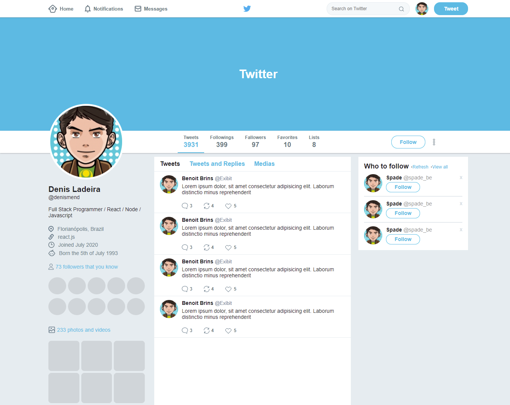
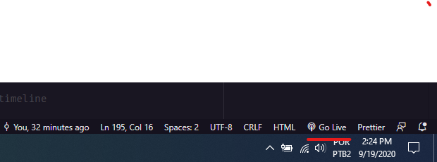

<p align="center">
   
</p>

<p align="center">	
   <a href="https://linkedin.com/in/denis-ladeira-814365115/">
      
   </a>
   
  

  <a href="https://github.com/denismend/nlw-02-proffy/commits/master">
    
  </a> 
  
  
</p>

<p align="center">
   :rocket: Static Web page from Twitter dashboard using Flexbox
</p>
  
<div align="center">
  <sub>Twitter UiClone. Built with ❤︎ by
    <a href="https://github.com/denismend">Denis Ladeira</a> and
    <a href="https://github.com/denismend/twitter-uiclone/graphs/contributors">
      contributors
    </a>
  </sub>
</div>

<p align="center">
  
</p>

# :pushpin: Table of Contents

* [How to Run](#construction_worker-how-to-run)
* [Contributing](#tada-contributing)
* [License](#closed_book-license)

# :construction_worker: How to run
```bash
# Clone the project on your computer via Download (option Code -> Download ZIP)
    - If you want to do it with Git, make sure you have Git installed, 
      follow the link https://git-scm.com/
    - then run the command in terminal:
        $ git clone https://github.com/denismend/twitter-uiclone.git
```

### 💻 Run Project
```
# Just open the index.html from project root in your browser :)

$ or open then project in Visual Studio Code (the best) and download "Live Server" extension.
$ then click the option below:
```
<p align="center">
  
</p>

# :tada: Contributing

There are many forms to contribute with the project, first of all you can give this github repo a Star.

If you want do help with the code follow the steps bellow

```ps
# Fork using GitHub official command line
# If you don't have the GitHub CLI, use the web site to do that.
$ gh repo fork denismend/twitter-uiclone

# Clone your fork
$ git clone {your-fork-url}
$ cd twitter-uiclone

# Create a branch with your feature
$ git checkout -b {branch-name}

# Make the commit with your changes
$ git commit -m 'Feat: {feature-name}'

# Send the code to your remote branch
$ git push origin {branch-name}
```

# :closed_book: License

Released in 2020 :closed_book: License

Made with love by [Denis Ladeira](https://github.com/denismend) 🚀.
This project is under the [MIT license](./LICENSE).
